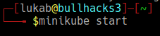
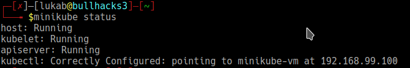
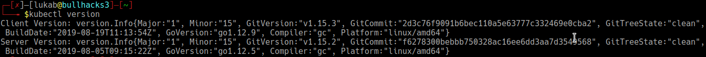

### Introduction to Kubernetes ###

Kubernetes is a docker orchestration system, which is useful for the purpose of
- Deploying Containers
- Scale in , scale out containers
- Release and roll back software releases

### Looking for k8s cheatsheets ###

[kubernetes cheatsheet](k8s_cheatsheets.md)

### Commony used resources in k8s

| Resource_Name |Abbreviated_Name|ApiVersion|
|---------------|----------------|----------|
|pod(s)|po|v1|
|deployment(s)|deploy|apps/v1|
|replicaset(s)|rs|apps/v1|
|replicacontroller(s)|rc|v1|
|service(s)|svc|v1|
|namespace(s)|ns||
|daemonset(s)|ds|apps/v1|
|persistentvolume(s)|pv||
|persistentvolumeclaim(s)|pvc||
|job(s)|batch/v1|
|cronjob(s)||


### Various object or resource of k8s

1. [Pods](#Pods)
2. [Services](#Services)
3. [Deployments](#Deployments)
4. [ReplicationController](#ReplicationController)
5. [ReplicaSet](#ReplicaSet)
6. 

### Brief Explaination about various componetens of k8s

### Pods
- Instance of docker containers 
- Atomic unit of scheduling
- Every pod inside the k8s, has its own IP address.
- Each container in a pod, shares the same namespace volumes

Q) Why we require multi container pod?
    - Require an helper module for achieving the app functionality

Example of pod manifest file:
```
### Api for kubernetes resources
apiVersion: v1
### Kind of resource to be deployed
kind: Pod
### Metdata associated with  the pod definition
metadata:
    name: pod-test
    lables:
        env: test
### What to contain inside a pod
spec:
    containers:
    - name: figlet container
      image: bakugupta/figlet:v2
```

**Create a pod**
```
kubectl create -f pod1.yaml
```
**Check the  status of a pod**
```
kubectl get pods
kubectl get pods -o wide
kubectl get pods -o yaml
kubectl get pods -o json
kubectl describe pod <pod_name>
```

### Services
### Deployments
- Define as well as maintain the desired state of resources and references
|Parts|Explaination|
|-----|------------|
|apiVersion||
|kind| specifies the resource of object to be create|
|metadata| used to identify a resource uniquely in k8s|
|spec| declared the desired state of an object or resource |

- Deployments related commands
Various commands used for the deploymenys:
    - kubectl get deployments : to get list of all the deployments
    - kubectl rollout status  : get status of deployment roll outs
    - kubectl set image       : set the image of deployment
    - kubectl rollout history : history of the rollout
```
apiVersion: apps/v1
kind: deployment
metadata:
    name:
    namespace:
    labels:
        key: value
spec:
    replicas: 3
    selector:
        matchLabel:
            app: deployment
    templates:

```
### ReplicationController
- Ensure that specified number of pods are running at all time
- Replication controller and pods are associated with the "labels"
Purpose:
    - High  Availability
    - Load Balancing
Example:
```
apiVersion: v1
kind: ReplicationController
metadata:
    name: figlet-replication-controller
spec:
    selector:
        env: testing
    replicas: 1
    template:
        metadata:
            name: figlet-pod
            label:
                env: testing
        spec:
            container:
            - name: figlet
              image: bakulgupta/figlet:v2
```   


### ReplicaController
### ReplicaSet


### Components and their functions

| Name of Component | Function  |
|-------------------|-----------|
| Pods              |   hello   |
| Deployments       |   hello   |
| Services          |   hello   |
| Services          |   hello   |
| Services          |   hello   |
| Services          |   hello   |
| Services          |   hello   |
| Services          |   hello   |
| Services          |   hello   |


### Local k8s installation ( i.e minikube )

```
#! /bin/bash

function minikube(){
    curl -Lo minikube https://storage.googleapis.com/minikube/releases/latest/minikube-linux-amd64 && chmod +x minikube
    sudo mkdir -p /usr/local/bin/
    sudo install minikube /usr/local/bin/
} 

funtion kubectl(){
    curl -LO https://storage.googleapis.com/kubernetes-release/release/`curl -s https://storage.googleapis.com/kubernetes-release/release/stable.txt`/bin/linux/amd64/kubectl
    chmod +x ./kubectl
    sudo mv ./kubectl /usr/local/bin/kubectl
}

echo "Install the latest minikube in the linux machine"
minikube
echo "Install the kubenetes controller manager"
kubectl
```

### Running Local Minikube Node

**Step: 1 Run the minikube**

 
```
minikube start 
```



**Step 2: Check the status of minikube cluster**
```
minikube status
```


**Step 3: Check the k8s controller version**
```
kubectl vevrsion
```


**Step 4: Get the nodes in k8s cluster**
```
kubectl get nodes
```


**Kubeadm**: Command line utility that help in the installation and configuration of k8s  cluster

kubeadm commands:

| Commands     |  Node  |            Purpose                   |
| ------------ | ------ | -------------------------------------|
| kubeadm init | Master | Initialize the node as master node   |
| kubeadm join | Worker | Joins the worker node to the cluster |
| kubeadm token| Worker | Generate the token                   |
| kubeadm version| Worker,Master | Shows the version of kubeadm|
| kubeadm upgrade plan| Worker,Master| Upgrade or downgrade the k8s cluster|

Following steps to be carried:

**Step 1:** Install three vms

**Step 2:** Disbale swap on all machines
```
swapoff -a
```
**Step 3:** Disable selinux on all virtual machines
```
setenforce 0
```
**Step 4:** Reboot all the  nodes

**Step 5:** Install following packages on all server
- docker
- kubelet
- kubectl
- kubeadm

**Step 6:** Initialize  the  master node
```
kubeadm init 
```
**Step 7:** Configure pod network
- Flanner
- Calico
- Weave

**Step 8:** Join worker node to the  cluster
```
kubeadm join 
```


References:

1. [Official Kubectl Cheatsheet](https://kubernetes.io/docs/reference/kubectl/cheatsheet/)
2. [Official Kubectl Reference](https://kubernetes.io/docs/reference/kubectl/kubectl/)