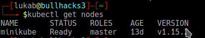

### Introduction to Kubernetes ###

Kubernetes is a docker orchestration system, which is useful for the purpose of
- Deploying Containers
- Scale in , scale out containers
- Release and roll back software releases

### Looking for k8s cheatsheets ###

[kubernetes cheatsheet](k8s_cheatsheets.md)


### Various object or resource of k8s

1. [Pods](#Pods)
2. [Services](#Services)
3. [Deployments](#Deployments)
4. [ReplicaController](#ReplicaController)
5. [ReplicaSet](#ReplicaSet)
6. 

### Brief Explaination about various componetens of k8s

### Pods
- Instance of docker containers 

### Services
### Deployments
- Define as well as maintain the desired state of resources and references
|Parts|Explaination|
|-----|------------|
|apiVersion||
|kind| specifies the resource of object to be create|
|metadata| used to identify a resource uniquely in k8s|
|spec| declared the desired state of an object or resource |

- Deployments related commands
Various commands used for the deploymenys:
    - kubectl get deployments : to get list of all the deployments
    - kubectl rollout status  : get status of deployment roll outs
    - kubectl set image       : set the image of deployment
    - kubectl rollout history : history of the rollout
```
apiVersion: apps/v1
kind: deployment
metadata:
    name:
    namespace:
    labels:
        key: value
spec:
    replicas: 3
    selector:
        matchLabel:
            app: deployment
    templates:

```


### ReplicaController
### ReplicaSet


### Components and their functions

| Name of Component | Function  |
|-------------------|-----------|
| Pods              |   hello   |
| Deployments       |   hello   |
| Services          |   hello   |
| Services          |   hello   |
| Services          |   hello   |
| Services          |   hello   |
| Services          |   hello   |
| Services          |   hello   |
| Services          |   hello   |


### Local k8s installation ( i.e minikube )

```
#! /bin/bash

function minikube(){
    curl -Lo minikube https://storage.googleapis.com/minikube/releases/latest/minikube-linux-amd64 && chmod +x minikube
    sudo mkdir -p /usr/local/bin/
    sudo install minikube /usr/local/bin/
} 

funtion kubectl(){
    curl -LO https://storage.googleapis.com/kubernetes-release/release/`curl -s https://storage.googleapis.com/kubernetes-release/release/stable.txt`/bin/linux/amd64/kubectl
    chmod +x ./kubectl
    sudo mv ./kubectl /usr/local/bin/kubectl
}

echo "Install the latest minikube in the linux machine"
minikube
echo "Install the kubenetes controller manager"
kubectl
```

### Running Local Minikube Node

**Step: 1 Run the minikube**

 
```
minikube start 
```


**Step 2: Check the status of minikube cluster**
```
minikube status
```


**Step 3: Check the k8s controller version**
```
kubectl vevrsion
```


**Step 4: Get the nodes in k8s cluster**
```
kubectl get nodes
```



References:

1. [Official Kubectl Cheatsheet](https://kubernetes.io/docs/reference/kubectl/cheatsheet/)
2. [Official Kubectl Reference](https://kubernetes.io/docs/reference/kubectl/kubectl/)